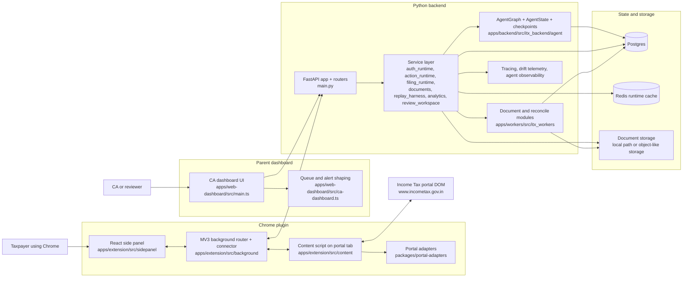
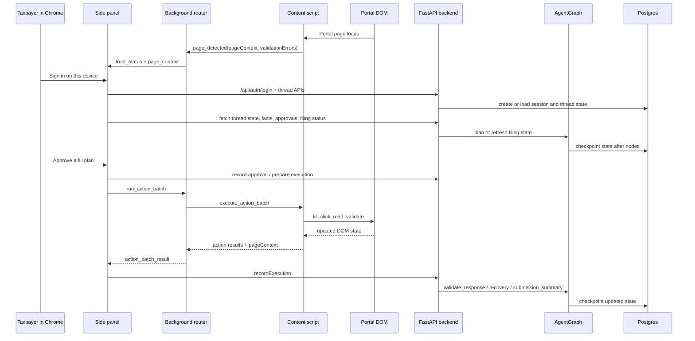
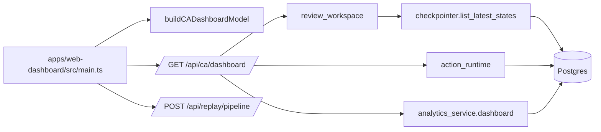
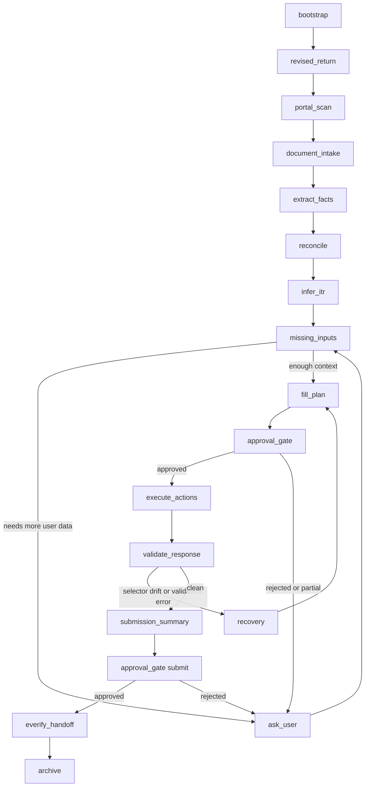

# Architecture

This document explains how the repo is structured today, how the components interact at runtime, and how the filing agent is assembled internally.

## 1. Repository map

| Path | Role in the system | What it owns |
|---|---|---|
| `apps/extension` | Chrome plugin | React side panel, MV3 background service worker, content scripts, auth session handling |
| `apps/web-dashboard` | Parent dashboard / reviewer dashboard | Vite TypeScript UI for queue status, replay health, and ops alerts |
| `apps/backend` | Python control plane | FastAPI app, auth, filing APIs, approvals, replay, analytics, review workspace, agent orchestration |
| `apps/workers` | Python document-processing library layer | Document parsing, normalization, reconciliation helpers, queue helpers |
| `packages/portal-adapters` | Portal DOM abstraction | Page detection, form schema extraction, validation scraping |
| `packages/action-dsl` | Browser automation contract | Closed set of browser actions used between backend and extension |
| `packages/rules-core` | Deterministic tax logic | Required schedules, disclosure checks, rules engine |
| `packages/tax-schema` | Shared schema artifacts | Assessment-year and tax-shape schemas used across the repo |

## 2. System overview



### What this means in practice

- The product has two human-facing frontends: the Chrome plugin for the filing flow and the parent dashboard for reviewer and operations visibility.
- The Chrome plugin is the active browser automation surface. It watches the portal DOM, collects page context, and executes approved browser actions.
- The dashboard is a read-heavy control surface. It aggregates latest filing thread state, queue pressure, replay health, drift telemetry, and runtime health.
- The Python backend is the control plane. It authenticates users, stores durable state, runs filing logic, builds approvals, records executions, and coordinates the agent lifecycle.
- Postgres is the main source of truth for thread state, approvals, executions, analytics events, and agent checkpoints.
- Redis is a runtime helper for rate limiting and event buffering, not the main database.
- The worker code exists today mostly as Python library modules imported by backend services. The local worker container is still a stub, so the current runtime is more integrated than fully distributed.

## 3. Frontend architecture

The repo has two different frontend styles.

### Chrome plugin frontend

- The side panel UI in `apps/extension/src/sidepanel/App.tsx` is a React app.
- It stores auth and filing-thread session state in Chrome storage.
- It talks to the backend through REST helpers in `apps/extension/src/sidepanel/backend.ts`.
- It also talks to the background worker through `chrome.runtime.sendMessage(...)` to snapshot the page, execute action batches, and receive trust or page-context updates.

### Parent dashboard frontend

- The dashboard in `apps/web-dashboard/src/main.ts` is a Vite TypeScript app, not a React app.
- It renders HTML directly, stores a session in `localStorage`, logs in with `/api/auth/login`, fetches `/api/ca/dashboard`, and can trigger `/api/replay/pipeline`.
- `buildCADashboardModel(...)` converts raw backend payloads into queue counts, client risk levels, operations alerts, and recommended reviewer actions.

### Why the split exists

- The Chrome plugin is optimized for live portal interaction, approvals, and in-browser automation.
- The parent dashboard is optimized for supervision, queue triage, and platform visibility.
- Both frontends share the same backend and the same thread state, but they serve different roles.

## 4. How the Chrome plugin comes into the picture

The Chrome plugin is the bridge between backend decisions and the real portal DOM.

### Runtime responsibilities by extension layer

| Extension layer | Responsibility |
|---|---|
| Side panel | Sign-in, thread bootstrap, consent flow, approvals, execution requests, evidence and submission UI |
| Background service worker | Verifies the portal domain, owns the backend WebSocket connection, routes runtime messages, forwards action batches |
| Content script | Detects the portal page, snapshots fields and validation errors, executes closed-set browser actions |
| Portal adapters | Provide page detection, form schema extraction, and validation scraping |

### Chrome plugin interaction flow



### Key design point

The plugin is not a free-form automation bot. The content script only executes a closed set of tool calls and only after the side panel and backend have created the necessary proposal and approval records.

## 5. How the parent dashboard works

The parent dashboard is the reviewer and operations view over all filing threads a user can access.

### Dashboard data path

1. The dashboard signs in using `/api/auth/login`.
2. It calls `/api/ca/dashboard`.
3. `ca_workspace.dashboard()` gathers the latest accessible checkpointed states using `review_workspace.list_accessible_states(...)`.
4. Each thread is enriched with action activity, pending approvals, sign-offs, submission blockers, support mode, and last execution summary.
5. `analytics_service.dashboard()` contributes platform-level data such as replay stats, drift telemetry, runtime health, tracing status, and agent observability.
6. `buildCADashboardModel(...)` converts that backend payload into overview cards, queue counts, risk labels, and alert banners.

### Dashboard architecture in one view



### What the dashboard is really showing

- Who can submit and who is blocked
- Which threads need reviewer sign-off or CA handoff
- Which threads have mismatch pressure or pending approvals
- Whether replay success is slipping
- Whether drift, runtime health, or agent failures are creating operational risk

## 6. How the Python backend comes into the picture

The Python backend is the integration point for every durable workflow.

### Main backend layers

| Layer | Responsibility |
|---|---|
| `main.py` | Starts FastAPI, applies middleware, auth guard, CORS, startup health checks, DB initialization |
| API routers | Expose auth, threads, documents, actions, replay, filing, CA workspace, security, tax facts, WebSocket |
| Service layer | Encapsulates approvals, document ingestion, replay, analytics, review handoff, filing state, runtime cache |
| Agent layer | Runs ordered node steps over shared `AgentState`, with tracing and checkpointing |
| Worker library layer | Document parsing, normalization, reconciliation helpers, security scanning |

### What happens on startup

1. FastAPI boots.
2. The DB connection pool is initialized.
3. SQL migrations in `apps/backend/src/itx_backend/db/migrations` are applied automatically.
4. Startup health validates database access, document storage writability, configuration, runtime cache, and observability settings.

### How Python connects to the rest of the repo

- The backend imports `itx_workers` modules directly for document processing and reconciliation.
- The backend imports no portal DOM code directly; it delegates page detection and action execution to the extension.
- The backend persists all durable workflow state in Postgres.
- The backend uses Redis only for runtime helpers.
- The backend exposes the control plane that both the Chrome plugin and the parent dashboard depend on.

### Important implementation note

The repo has configuration for AI providers and Langfuse-compatible tracing, but the current orchestration code is dominated by deterministic service and node logic. The code shown in the agent and service layers is more of a stateful workflow engine plus browser tools than a heavy direct-model-inference loop.

## 7. How agents are built today

The filing agent is currently built as a custom sequential runner with checkpointed shared state.

### Core building blocks

| Building block | Current implementation |
|---|---|
| Shared state | `AgentState` Pydantic model |
| Node orchestration | `AgentGraph` with an ordered list of async node runners |
| Checkpointing | `AsyncPostgresCheckpointer` writing JSON snapshots to `agent_checkpoints` |
| Observability | tracing spans plus `agent_observability.record(...)` around every node |
| Recovery | explicit nodes such as `validate_response` and `recovery` |

### Current agent architecture

```mermaid
flowchart TD
    Trigger[Thread start, resume, or API-triggered work]
    State[AgentState\nthread_id, portal_state, tax_facts, documents,\nfill_plan, approvals, execution, submission, evidence]
    Runner[AgentGraph.run(state)]
    Nodes[Ordered async nodes\nbootstrap -> revised_return -> portal_scan -> document_intake ->\nextract_facts -> reconcile -> infer_itr -> explain_step ->\nlist_required_info -> missing_inputs -> fill_plan -> approval_gate ->\nexecute_actions -> validate_response -> recovery -> submission_summary ->\napproval_gate -> everify_handoff -> ask_user -> archive]
    Obs[Tracing + agent_observability]
    CP[AsyncPostgresCheckpointer\nsave(state_json)]
    PG[(agent_checkpoints)]

    Trigger --> State --> Runner --> Nodes
    Nodes --> State
    Nodes --> Obs
    Nodes --> CP --> PG
```

### What each phase does

| Phase | Main nodes | Purpose |
|---|---|---|
| Context bootstrap | `bootstrap`, `revised_return`, `portal_scan` | establish thread context, current page, return mode |
| Intake and fact building | `document_intake`, `extract_facts`, `reconcile`, `infer_itr` | turn uploaded documents into canonical facts and mismatches |
| Planning | `explain_step`, `list_required_info`, `missing_inputs`, `fill_plan` | decide what is known, what is missing, and what can be filled |
| Human control and browser execution | `approval_gate`, `execute_actions`, `validate_response`, `recovery` | require approval, execute in the portal, validate results, handle drift |
| Submission and closure | `submission_summary`, second `approval_gate`, `everify_handoff`, `ask_user`, `archive` | prepare final filing state, handoff e-verify, archive artifacts |

## 8. Tool calls and action contracts

There are several kinds of tool calls in the system. The most important ones are the browser automation calls.

### 8.1 Browser action tool calls

The extension content layer executes a closed set of action types defined by the action DSL and content action batch runner.

| Action type | Purpose |
|---|---|
| `fill` | Set a portal field value |
| `click` | Click a portal control |
| `read` | Read a field value from the DOM |
| `get_form_schema` | Return the adapter-defined schema for the current page |
| `get_validation_errors` | Scrape current page validation errors |

These are intentionally narrow. The model or planner does not get arbitrary JavaScript execution in the page.

### 8.2 Extension runtime messages

The extension layers communicate with structured runtime messages such as:

- `page_detected`
- `trust_status`
- `run_action_batch`
- `snapshot_active_page`
- `navigate_active_tab`
- `auth_session_updated`
- `auth_session_cleared`

### 8.3 Backend durable workflow calls

The backend service layer turns UI intent into durable records. The major ones are:

- create proposal
- create approval
- record approval decision
- record execution
- fetch filing state
- build replay dashboard and replay pipeline
- build CA dashboard aggregation

### 8.4 Current WebSocket reality

The Chrome background connector is ready for backend-pushed messages, but the current backend WebSocket implementation is still thin. Today it mainly authenticates and returns `hello` or `echo` messages, while most meaningful workflow coordination still happens through REST plus Chrome runtime messaging.

## 9. How everything connects end to end

At the highest level, the system forms one loop:

1. The portal DOM is observed by the content script.
2. The side panel turns that page context into human-reviewed filing actions.
3. The backend stores durable state, approvals, executions, and analytics.
4. The agent updates `AgentState` and checkpoints progress after every node.
5. The dashboard reads those durable states back out and shows queue, risk, and ops health.

That means the extension is the live execution surface, the backend is the durable decision surface, and the dashboard is the supervisory surface.

## 10. LangGraph mental model versus current implementation

The repo describes the agent as a LangGraph-style system, and conceptually that is the right mental model: shared state, named nodes, human pauses, resumability, and checkpointed transitions.

The important implementation detail is this:

- Conceptually: this is a LangGraph-like state machine.
- Concretely today: the code uses a hand-built `AgentGraph` runner and `AsyncPostgresCheckpointer`, not a compiled `langgraph.StateGraph` object.

### Conceptual LangGraph view



### If this were migrated to a native LangGraph builder

The migration would be straightforward in concept:

1. `AgentState` would remain the shared typed state.
2. Each file in `agent/nodes` would become a graph node function.
3. Conditional edges would represent the `missing_inputs`, approval, validation, and recovery branches instead of being flattened into one ordered node list.
4. The Postgres checkpoint table would remain the persistence layer.

So the current code is already architecturally close to LangGraph, but the implementation is still a custom orchestrator.

## 11. High-level summary

- The Chrome plugin is the execution edge: it sees the real portal and performs approved DOM actions.
- The parent dashboard is the supervision edge: it reads aggregated thread state, replay health, and ops telemetry.
- The Python backend is the control plane: it authenticates, persists, plans, validates, and records everything.
- The agent is built from shared state, ordered nodes, durable checkpoints, and human approval gates.
- The worker layer currently behaves more like imported Python modules than a fully separate worker fleet.
- The architecture is best understood as a LangGraph-style filing workflow implemented today with a custom graph runner.
